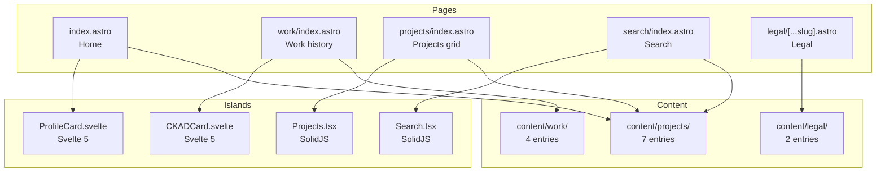

# Architecture

## Overview

crstian.me is the personal portfolio website of Cristian Gutierrez (Site Reliability Engineer). Built with Astro 6 (static SSG) with SolidJS and Svelte 5 islands, Tailwind CSS, and content collections for projects and work history. Features an interactive holographic profile card (Svelte 5), Fuse.js client-side search, dark mode with star/meteor animations, and a glitch-effect 404 page.

## Module & Version

- **Astro**: 6.x
- **Svelte**: 5.50.0
- **SolidJS**: 1.9.11
- **Tailwind CSS**: 4.x (via `@astrojs/tailwind` + `@tailwindcss/postcss`)
- **Bun**: package manager
- **Node**: >=20.0.0 (`.nvmrc` says 24)

## Code Structure

| Path | Framework | Purpose |
|---|---|---|
| `src/pages/index.astro` | Astro | Home — hero, profile card, tech stack, projects, socials |
| `src/pages/work/index.astro` | Astro | Work history timeline with CKAD card |
| `src/pages/projects/index.astro` | Astro | Projects grid (SolidJS filter) |
| `src/pages/projects/[...slug].astro` | Astro | Individual project page |
| `src/pages/search/index.astro` | Astro | Fuse.js fuzzy search |
| `src/pages/legal/[...slug].astro` | Astro | Legal pages (privacy, terms) |
| `src/pages/rss.xml.ts` | Astro | RSS feed endpoint |
| `src/pages/robots.txt.ts` | Astro | Dynamic robots.txt |
| `src/pages/404.astro` | Astro | Glitch-effect 404 |
| `src/components/ProfileCard.svelte` | Svelte 5 | Holographic 3D profile card with ASCII art |
| `src/components/CKADCard.svelte` | Svelte 5 | Holographic 3D CKAD certification card |
| `src/components/Projects.tsx` | SolidJS | Tag-filterable projects grid |
| `src/components/Search.tsx` | SolidJS | Fuse.js-powered search |
| `src/components/ArrowCard.tsx` | SolidJS | Content card with animated arrow |
| `src/components/Header.astro` | Astro | Fixed nav header |
| `src/components/Footer.astro` | Astro | Footer with socials, legal links |
| `src/components/BaseHead.astro` | Astro | SEO meta, OG tags, fonts, analytics |
| `src/components/TwinklingStars.astro` | Astro | Dark mode star animation |
| `src/components/MeteorShower.astro` | Astro | Dark mode meteor animation |
| `src/consts.ts` | TS | Site metadata, nav links, socials |
| `src/content/` | Markdown | Content collections: work, projects, legal |
| `src/lib/utils.ts` | TS | cn(), formatDate(), readingTime() |

## Architecture

## Content Collections

| Collection | Entries | Content |
|---|---|---|
| `work` | 4 | PCComponentes, Bemyvega ×2, Optare Solutions |
| `projects` | 7 | Llamit, Tesdash, Aceplay, Tesdecrypt, Gluetun Exporter, Storage Box Exporter, TeslaMate Achievements |
| `legal` | 2 | Privacy policy, Terms of use |
| `blog` | 0 | Defined but empty — blog is external at blog.crstian.me |

## Deployment

- **Platform**: Vercel (per README) or Cloudflare Pages (per analytics beacon)
- **Build**: `astro check && astro build` (static SSG)
- **No deploy workflow** in `.github/workflows/` — only TruffleHog secret scanning and stale issue closer
- **Analytics**: Umami (self-hosted) + Rybitt.io + Cloudflare Insights
- **CDN**: cdn.crstian.me
- **Blog**: External at blog.crstian.me (separate Hugo repo)

## CI/CD

| Workflow | Purpose |
|---|---|
| `secrets.yaml` | TruffleHog secret scanning (broken — YAML syntax error) |
| `stale.yaml` | Auto-close stale issues (10 days) |

## Known Issues

1. **`secrets.yaml` YAML syntax error** — duplicate `steps:` key breaks the entire workflow.
2. **`tailwind.config.mjs` uses `require()` in ESM** — `.mjs` files cannot use `require()`. Should use `import`.
3. **`ArrowCard.tsx` TypeScript error** — `tag` parameter implicitly has `any` type. May fail `astro check` in strict mode.
4. **`404.astro` broken CSS link** — references `/src/styles/404.css` which doesn't exist in production builds.
5. **`404.astro` HTTP font import** — `@import url("http://fonts.cdnfonts.com/css/anurati")` blocked by mixed-content policy on HTTPS.
6. **Duplicate content config** — both `src/content.config.ts` (new) and `src/content/config.ts` (legacy) exist.
7. **`public/robots.txt` has localhost URL** — `Sitemap: http://localhost:4321/sitemap-index.xml`. Conflicts with dynamic `robots.txt.ts`.
8. **CLAUDE.md stale** — says "Astro 5" (actually 6), says "primarily a Go codebase" (completely wrong).
9. **Unused dependencies** — `d3`, `motion` listed but never imported.
10. **Unused components** — `Blog.tsx`, `Counter.tsx` never imported.
11. **`world.json` dead weight** — large GeoJSON file, never imported.
12. **Footer copyright says © 2024** — outdated.
13. **`blog` collection empty** — defined in config but no `src/content/blog/` directory exists. Search and RSS will return empty for blog posts.
14. **`.nvmrc` says 24 but `package.json` says >=20.0.0** — inconsistent Node version.
15. **Deployment platform ambiguous** — README says Vercel, analytics references Cloudflare.
